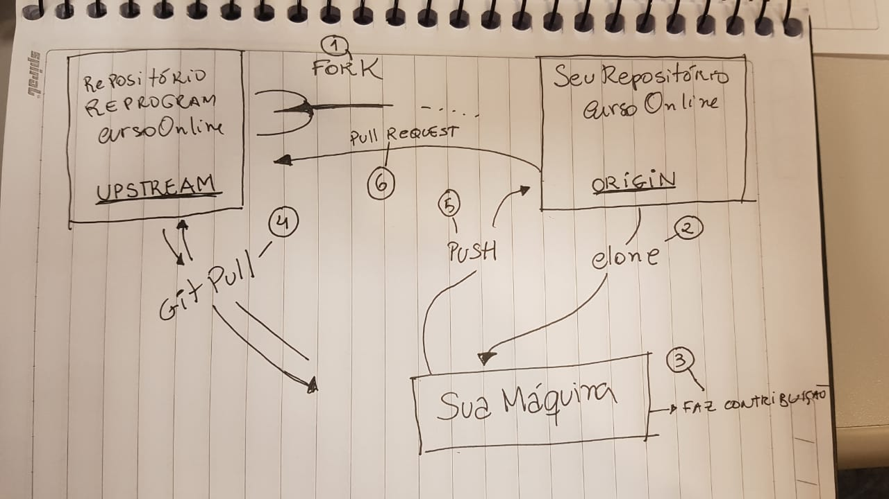

# Projeto - M de Maravilhosa

## Sobre o projeto: 

Precisamos falar sobre mulheres que mudaram o mundo. 

* like a girl (https://www.youtube.com/watch?v=XjJQBjWYDTs)
* microsoft (https://www.youtube.com/watch?v=tNqSzUdYazw)

## Orientações para git/github:

* forkar o respositório
* após isso, clone o projeto do *seu github* na sua máquina: `git clone url-do-projeto`
* agora precisamos confirgurar nosso projeto para que o git saiba que precisa puxar atualizações do repositório raíz da reprograma, ou seja, o *upstream*. 
* `git remote -v` veja que temos apenas o repositório *origin*
* agora vamos adicionar o upstream `git remote add upstream url-do-repositorio-que-voce-forkou`
* `git remote -v` veja agora que temos os dois repositórios: origin e upstream. 
* antes de começar a codar, crie sua branch: `git checkout -b nome-da-sua-branch`
* Fazer alterações e codigos necessários
* `git add .`
* `git commit -m "mensagem-sobre-o-que-foi-feito"`
* antes do push, vamos atualizar nossa branch com a master do UPSTREAM: `git pull upstream master`
* agora sim: `git push origin nome-da-sua-branch`
* entre no repositório do github e faça a *pull request* 

## Revisão e tricks de CSS 

 Vamos relembrar um pouco sobre as especificidades do CSS (https://www.w3schools.com/CSS/css_specificity.asp)
 O que são pseudo-classes (https://www.w3schools.com/css/css_pseudo_classes.asp)

 linear-gradiente:
 * doc - (https://developer.mozilla.org/en-US/docs/Web/CSS/linear-gradient)
 * example com imagem - (https://codepen.io/natalyapeixoto/pen/pBxYML)

## Revisão JavaScript Eventos 

* metodo addEventListener() (https://www.w3schools.com/jsref/met_element_addeventlistener.asp)
* Lista de Eventos (https://developer.mozilla.org/en-US/docs/Web/Events)

## Orientações para alteração do código:

* dentro da pasta *perfil-mulheres* crie uma outra pasta com nome da mulher que você escolheu
* dentro dessa pasta, crie um arquivo html com o nome da sua mulher, ex: *stephanie-shirley.html* 
* dentro dessa mesma pasta, crie sua pasta de imgs, css e js. 
* O layout é livre! Porém alguns pontos:
            - 1 arquivo html, 1 css e  1 javascript 
            - faça uso de html semântico 
            - mantenha um padrão na nomeação das classes 
            - site precisa ser responsivo 
            - mínimo de 2 sections
            - NAVBAR e FOOTER podem ser iguais aos da pagina principal. 
            - ao menos uso de uma pseudo-class do css. 
            - Uso de ao menos 1 eventlistener(javascript)

* na página home, na `<section class="maravilhosas container" id="mulheres-maravilhosas">`, encontre o seu nome. 
* no bloco que está o seu nome, substitua seu nome pelo nome da mulher homenageada e não esqueça de atualizar links com os caminhos das pastas

## Idéias de sites: 

* (https://codepen.io/carolinass/pen/WrPyja)
* (http://jorge-sanz.github.io/tribute-page/)
* (https://natalyapeixoto.github.io/)
* (https://codepen.io/h26k2/pen/yKdzLv?page=3)
* (https://codepen.io/jetthusher/pen/zapGwr) 
* (https://dutra21.github.io/projetoFinalReprograma/)
* (https://deboradom.github.io/venus/index.html)

## fotos sem direitos autorais

* https://pixabay.com/
* https://www.freepik.com/
* https://search.creativecommons.org/

### What's next?

vou morrer defendendo esses 3 canais de estudo:
1 - https://www.freecodecamp.org/
2 - https://javascript30.com/
3 - https://www.cursoemvideo.com/

AJAX - https://www.w3schools.com/xml/ajax_intro.asp
FETCH - https://www.mundojs.com.br/2018/04/25/vamos-falar-de-fetch/

'#100DaysOfCode'
Linkedin 
Porfólio 
*Github* 

